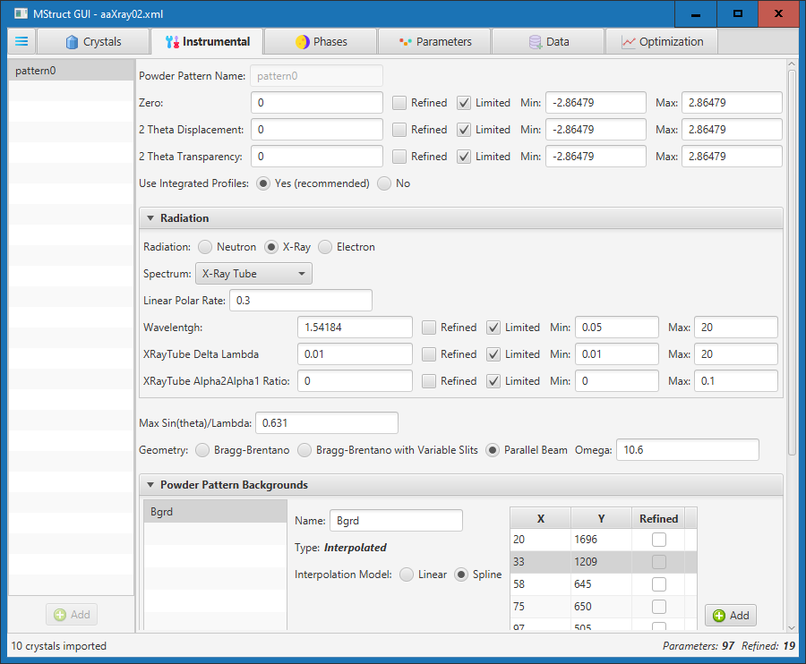

# MStruct GUI

MStruct GUI is an extension of the [MStruct](https://github.com/xray-group/mstruct) program for MicroStructure analysis of powder diffraction data.

It is a desktop application providing a graphical interface for calling MStruct and processing its results. Besides configuring input parameters users can review the output data in a graphical form and use fitted parameters.

## Features
* Platform independent desktop Java application
* Optimization run from the UI application showing calculated data, fitted parameters and MStruct logs
* Rich interactive chart depicting calculated and measured values, their difference, background levels and excluded regions
* Full edit of all crystal and instrumentals parameters
* Various types of powder pattern backgrounds are supported (Chebyshev, InvX, Interpolated)
* Definition of reflection profile components of various types (SizeLn, PVoightA, RefractionCorr, StressSimple)
* All parameters shown also in a tree like view allowing search, filtering and bulk editing.
* Excluded regions can be entered directly or interactively from the generated chart
* Import crystals definition from a cif file or an ObjctCryst xml file.
* View and edit crystals parameters
* Import and export of data from various formats


## Screenshots
Import crystals and edit their parameters:


Define and edit instrumental parameters, radiation type, background patterns or excluded regions:


Configure crystal phases and their parameters. Various types of reflection profile components can be added and configured.


Choose if arbitrary texture difraction points should be used, generated, refined or compute with provided parameters:


All parameters can be searched, filtered, reviewed and edited in a tree like view:


Import and review input data:


Optimization screen runs the simulation or refinement process calling the [MStruct](https://github.com/xray-group/mstruct) library and display its result:


Input and calculated data are displayed on an interactive chart:


Values of refined parameters can be reviewed and copied back to the model:


Excluded regions can be edited directly in the chart:


## Installation

##### The minimal distribution - `mstructgui-0.3-dist-min.zip`
1. Download the [mstructgui-0.3-dist-min.zip](released/mstruct-gui-0.3-dist-min.zip). Alternatively you can [Build and Assembly](#build-and-assembly) your own.
2. Extract the content of the zip file to a “base directory”. If the mstruct-gui was previously installed there make sure you don't overwrite the previous version of the MStructGUI.properties or make its backup first.
3. Download and install a suitable JDK, i.e. JDK version 11 or newer. It is recommended to use  [BellSoft's Liberica JDK 11 LTS](https://bell-sw.com/pages/downloads/#/java-11-lts) as it was used for testing.
4. Open the `MStructGUI.bat` for editing and change the `java_home` variable to a location where the JDK is installed.
5. In the `MStructGUI.properties` edit following two paths to be able to use FOX for transforming cif files and MStruct for Optimization:
   - fox.exe.path
   - mstruct.exe.path
6. Optionally in the `MStructGUI.properties` the `mstructgui.open.on.startup` can be set to a file which will be opened automatically on startup.
7. Run the application with `MStructGUI.bat`.


##### The distribution with JDK - `mstructgui-0.1-dist-withJDK.zip`
If the `mstructgui-0.1-dist-withJDK.zip` is used instead of `mstructgui-0.3-dist-min.zip` the installation steps are the same but the step 3 and 4 can be omitted.

##### The externals - `mstructgui-0.1-only-externals.zip`
The `mstructgui-0.1-only-externals.zip` doesn’t contain the MStructGUI application. It contains only both external programs. It should be unpacked to the same directory where previously one of the above distributions was installed. It is packed with `MStructGUI.properties` which configures the paths so the step 5 can be skipped.


## Build and Assembly
Use [Maven](https://maven.apache.org/index.html) to build the application with the following command in the project root directory (i.e. where the pom.xml file is):

```
mvn clean install
```
The `mstruct-gui-0.3-dist-min.zip` should be created in the target directory. Other two distributables mentioned above are currently disabled (commented out in the pom.xml) as they would fail unless the paths defined in the `src/assembly/assembly-withJDK.xml` and `src/assembly/assembly-externals.xml` are correct.


## Documentation

...


